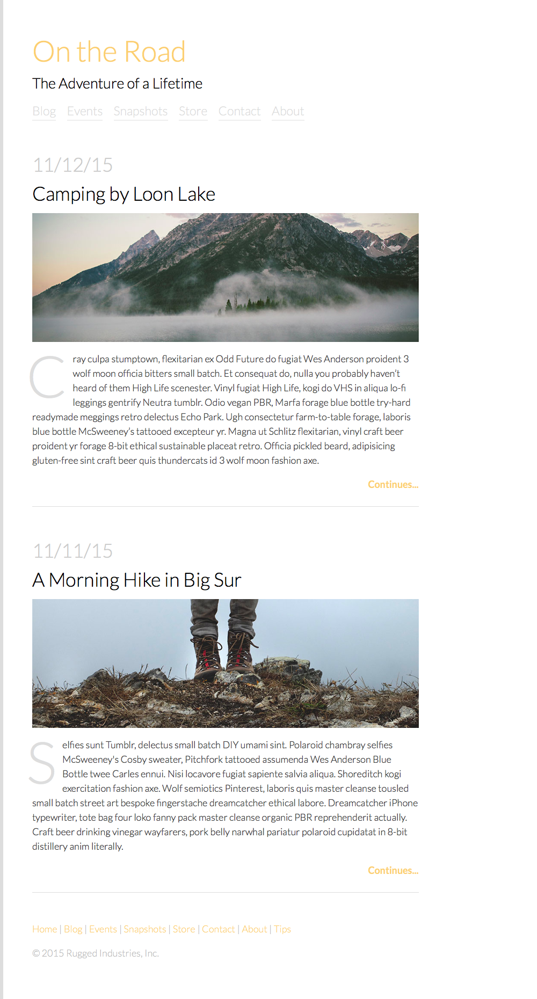

#  Lab: From Mockup to HTML/CSS

## Learning Objectives
- Use CSS to style a web page according to a mockup.

## Introduction
Working from a mockup will be part of your daily routine as a web developer. Mockups and specs — details about white space, size, color, and more — can vary depending on your designer. It's important to be incredibly detail-oriented when following a mockup, so be sure to communicate with your designer to clarify your needs. It may take time before you agree on the best way to share materials.

## Exercise
Using the provided HTML, add the CSS necessary to make the page resemble the mockup below.

### Requirements
- You will not need to make any edits to the HTML.
- Don't leave anything on the page unstyled — even if your CSS isn't perfect.

### Bonus
- Add hover effects to the nav.
- Imagine how you might use the `border` property to eliminate the need for the `|` characters in the nav.

#### Starter Code
This [starter code](starter-code) contains all the HTML you need to complete this lab.

#### Deliverable
The final design for the blog:

## Hungry for More?
Here are some additional exercises to practice on your own!

#### Beginner
- [Portfolio Blog](additional-labs/beginner/portfolio-blog)

#### Intermediate
- [Design Portfolio](additional-labs/intermediate/portfolio-design)
- [Hippie Portfolio](additional-labs/intermediate/portfolio-hippy)

#### Advanced
- [Portfolio Blog](additional-labs/advanced/moonrise-kingdom)
